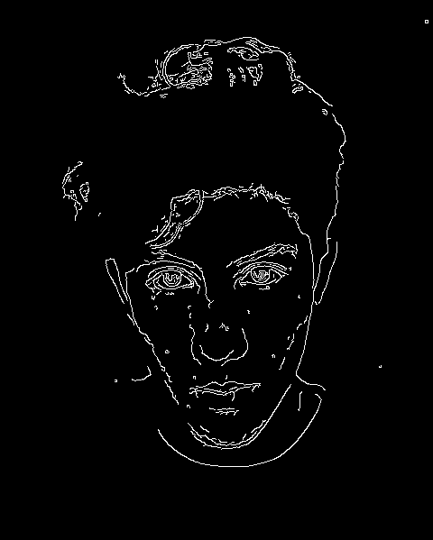
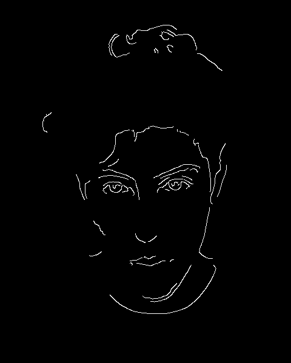
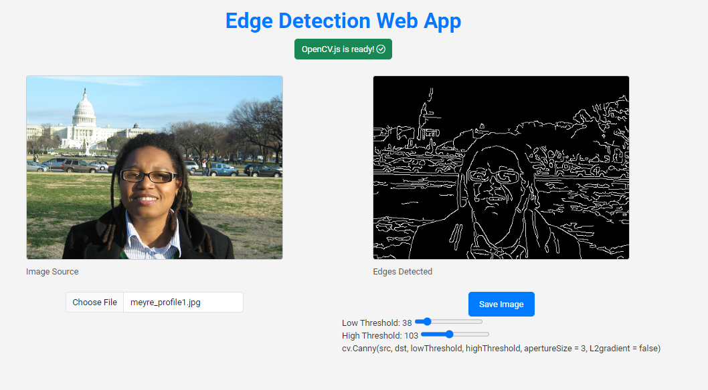

# Canny Edge Web App

This project is a simple web application where users can upload a local image and apply the **Canny Edge Detection** algorithm. The app displays both the original image and the Canny-detected result side by side, allowing the user to visualize the edge detection process interactively.

## Features

- **Upload Local Image**: Users can load any image from their local device.
- **Side-by-Side Display**: Once the image is uploaded, it is displayed on the left, and the Canny-detected image is shown on the right.
- **Adjustable Thresholds**: The user can interactively adjust the lower and upper thresholds using sliders, which control the sensitivity of the Canny edge detection.
- **Gaussian Blur Option**: Before applying the Canny algorithm, a **Gaussian Blur** is applied to the image to reduce noise. The blur uses a fixed aperture size of `3`.
- **Threshold Values**: A default setting is provided with a lower threshold of `108` and an upper threshold of `162`, but these values can be adjusted by the user.

## Algorithm Details

1. **Gaussian Blur**: To enhance the edge detection process, a Gaussian Blur is first applied to the image. This helps in reducing noise and producing cleaner edges.
2. **Canny Edge Detection**: The Canny algorithm is then applied using two thresholds: a lower threshold and an upper threshold. These thresholds define which edges are strong enough to be kept and which ones should be ignored.
3. **Adjustable Thresholds**: The user can control the sensitivity of the Canny algorithm by sliding the lower and upper threshold values.

## Example Results

### Without Gaussian Blur (Lower Threshold: 108, Upper Threshold: 162)

### With Gaussian Blur (Lower Threshold: 108, Upper Threshold: 162)

In the examples above, the first image shows the result of Canny Edge Detection without applying the Gaussian Blur. The second image shows the result after applying the blur with the same threshold values. Notice how the Gaussian Blur helps in reducing noise and improving the clarity of the edges.

## Web App in Action

After the image is processed, the web app displays both the original and edge-detected versions. Here's how the result appears on the web interface:

## How to Run the Project

1. Clone the repository.
2. Open the `index.html` file in your browser.
3. Upload an image by clicking the "Choose File" button.
4. Adjust the lower and upper threshold sliders to see how they affect the edge detection process.
5. The result will automatically update with the selected thresholds.

## Technologies Used

- **OpenCV.js**: The Canny Edge Detection algorithm is implemented using OpenCV's JavaScript bindings.
- **HTML/CSS/JavaScript**: Basic frontend technologies are used to build the interface.
- **Canvas API**: Used for rendering images directly in the browser.

## Conclusion

This web app allows users to experiment with the Canny Edge Detection algorithm by adjusting the threshold values and observing the effects of applying a Gaussian Blur beforehand. It's a simple yet powerful tool to visualize edge detection in real-time.
